# flutter_weixin

这是一个flutter版本的微信

### 打开ios模拟器 open -a Simulator

## Getting Started

For help getting started with Flutter, view our online
[documentation](https://flutter.io/).

## 效果图(左侧是android,右侧是ios)

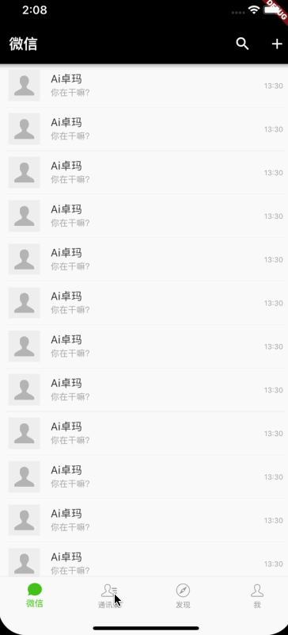

### 聊天界面
<table>
<tr>
<th>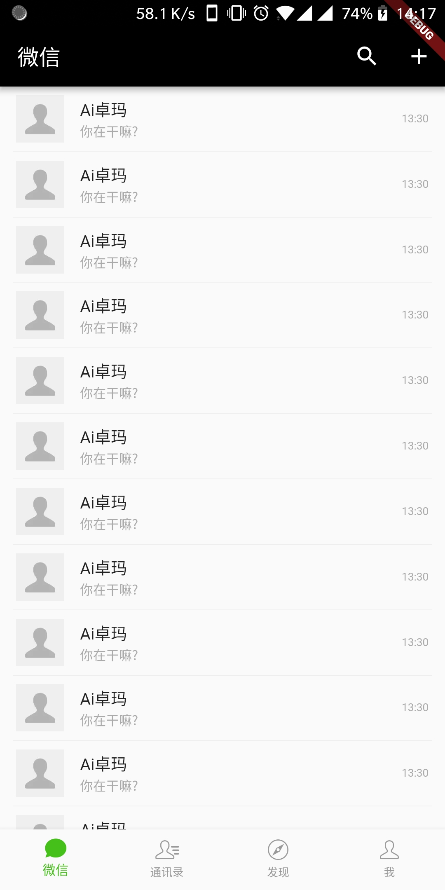</th>
<th>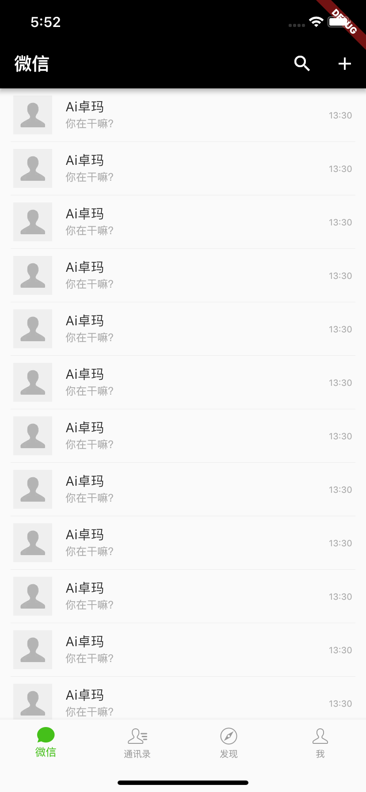</th>
</tr>
</table>

### 通讯录界面
<table>
<tr>
<th>
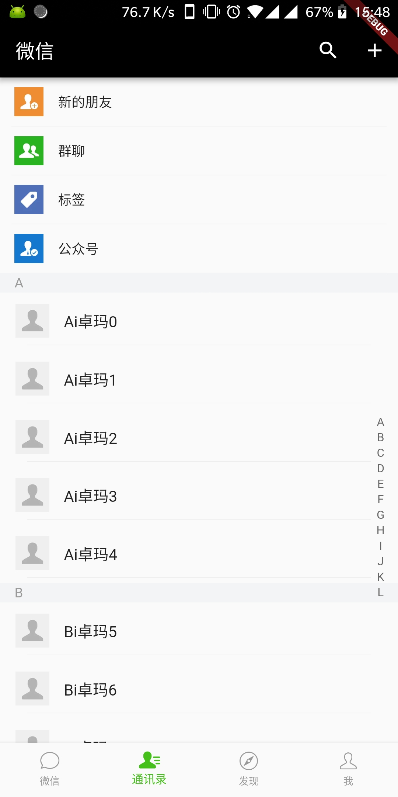</th>
<th>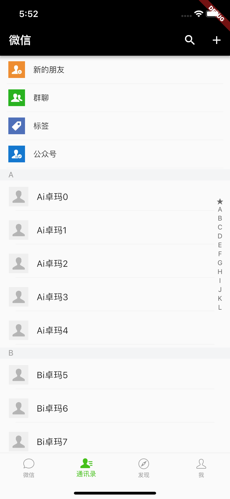
</th>
</tr>
</table>

### 发现界面
<table>
<tr>
<th>
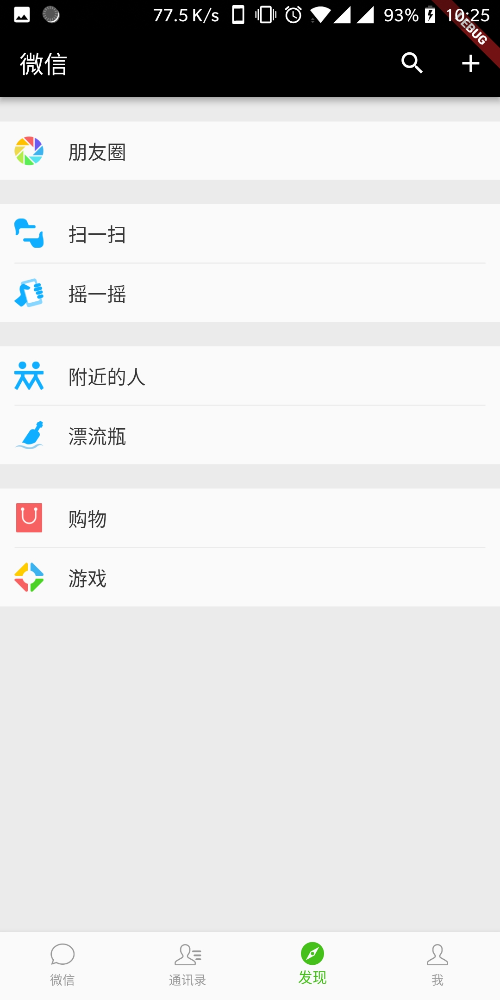</th>
<th>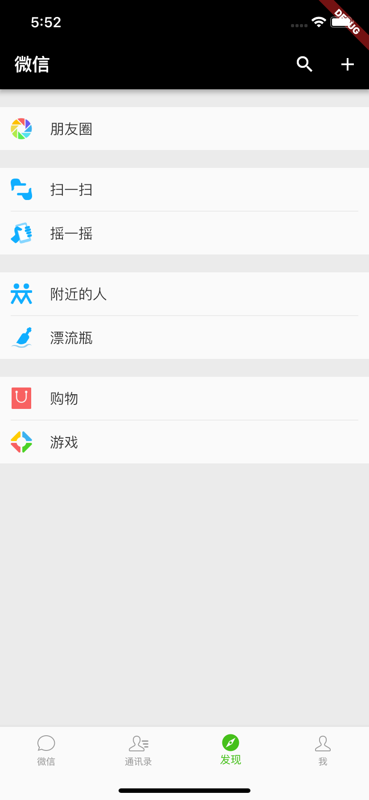
</th>
</tr>
</table>

### 我的界面
<table>
<tr>
<th>
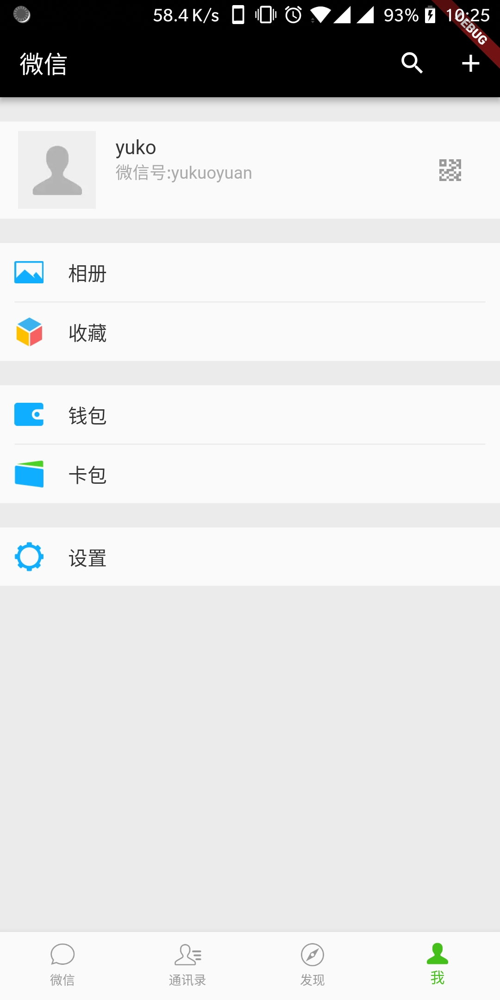</th>
<th>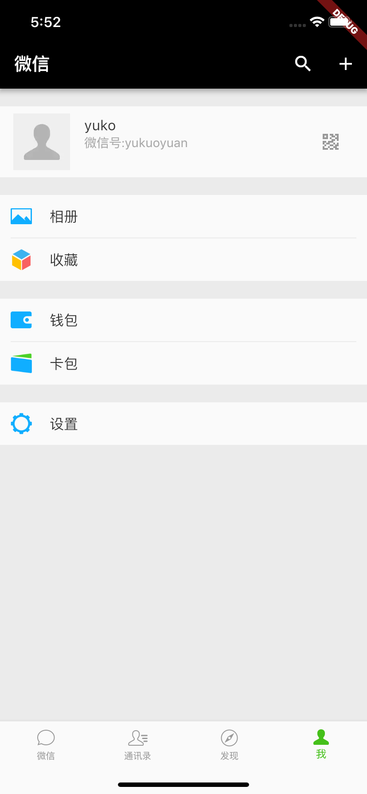
</th>
</tr>
</table>

### 个人信息界面

<table>
<tr>
<th>
</th>
<th>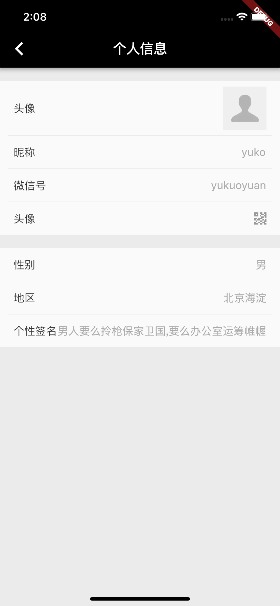
</th>
</tr>
</table>

### 修改个人信息
<table>
<tr>
<th>
</th>
<th>
</th>
</tr>
</table>

### 首页更多的弹窗
<table>
<tr>
<th>
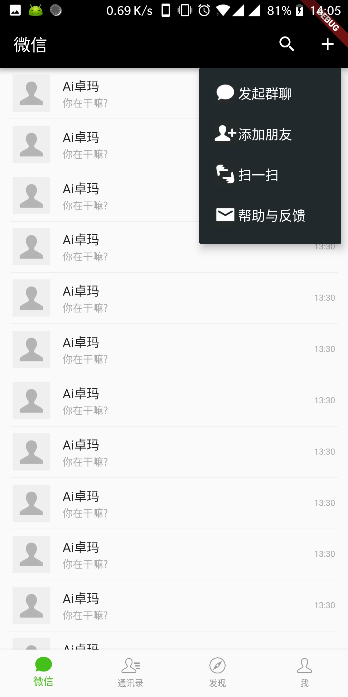</th>
<th>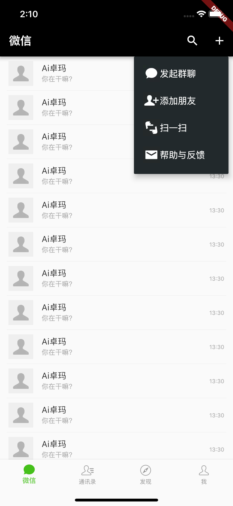
</th>
</tr>
</table>